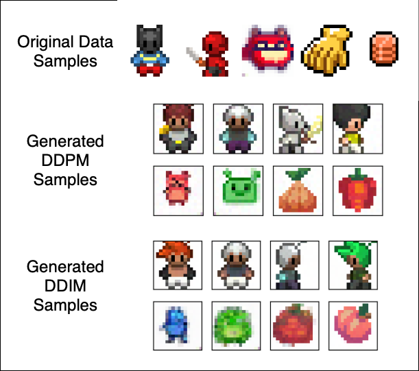

# DDPM From Scratch

Implementation of the Image Generation, Diffusion model adapted from the [paper](https://arxiv.org/abs/2006.11239). To test the capability to the most simple case, the model has been trained on the custom "Sprites" dataset from the [DeepLearning.ai](https://www.deeplearning.ai/short-courses/how-diffusion-models-work/) course.

Below can be seen a sampel from the training data and generated images from DDPM and DDIM generation algorithms. For more specific detail read the relative [notebook results](notebooks/1_visualize_sprites.ipynb) trained on 100 epochs with lr=3e-4. For effective training, please use a GPU.

<table>
    <tr>
        <td style="text-align: center;" colspan="2">
            
            <p>Example generated images</p>
        </td>
    </tr>
</table>

## Getting Started

```bash
    git clone https://github.com/Efesasa0/diffusion-image-generation.git
    cd diffusion-image-generation
    pip install -r requirements.txt
    python train.py --save_dir_weights 'weights/' --save_periods 5 --inference_outs_dir 'outs/' --inference 'ddpm'
```

### Arguments list

Arguments list

```bash
usage: train.py [-h] [--save_dir_weights SAVE_DIR_WEIGHTS] [--save_periods SAVE_PERIODS] [--inference_outs_dir INFERENCE_OUTS_DIR]
                [--inference INFERENCE] [--batch_size BATCH_SIZE] [--epochs EPOCHS] [--lr LR] [--features FEATURES] [--T T]
                [--beta_start BETA_START] [--beta_end BETA_END] [--dataset_name DATASET_NAME]

Train the diffusion model and optionally run generation

options:
  -h, --help            show this help message and exit
  --save_dir_weights SAVE_DIR_WEIGHTS
                        Directory to save the weights from training
  --save_periods SAVE_PERIODS
                        Integer to specify how often the model saves weights. Ex: save every 5 epochs
  --inference_outs_dir INFERENCE_OUTS_DIR
                        Directory to save the outputs from the generation
  --inference INFERENCE
                        Available options: ddpm, ddim
  --batch_size BATCH_SIZE
                        Size of batch to train and learn from
  --epochs EPOCHS       Number of epochs to train on
  --lr LR               Learning rate fro training
  --features FEATURES   Size of the hidden layer from the U-net architecture
  --T T                 The size of steps to reverse within the diffusion process
  --beta_start BETA_START
                        Start of the beta scheduler
  --beta_end BETA_END   End of the beta scheduler
  --dataset_name DATASET_NAME
                        Dataset name to train on
```

## TODO

- [x] argparse the training script
- [ ] add CIFAR-10, MNIST, CelebA for convenience.

### References

- deeplearing.ai course and dataset: [How Diffusion Models Work](https://www.deeplearning.ai/short-courses/how-diffusion-models-work/)
- [CIFAR-10](https://www.kaggle.com/c/cifar-10)
- MNIST
- [CelebA](https://mmlab.ie.cuhk.edu.hk/projects/CelebA.html)

#### Additional References

- [Denoising Diffusion Probabilistic Models](https://arxiv.org/abs/2006.11239)
- [Denoising Diffusion Implicit Models](https://arxiv.org/abs/2010.02502)
